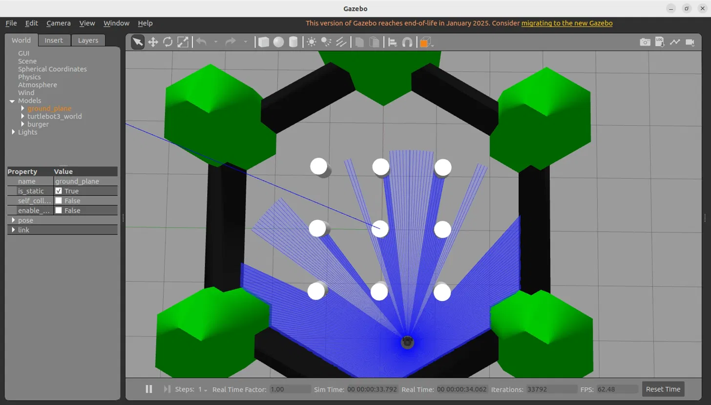
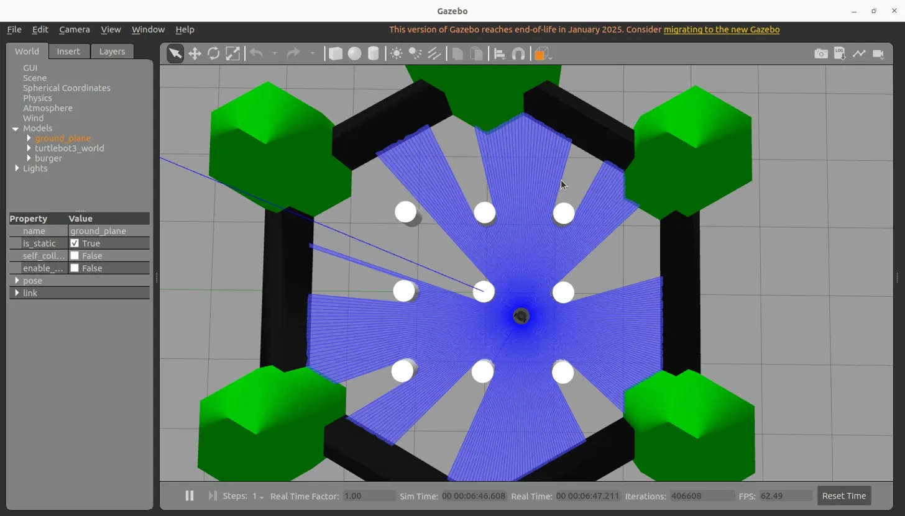
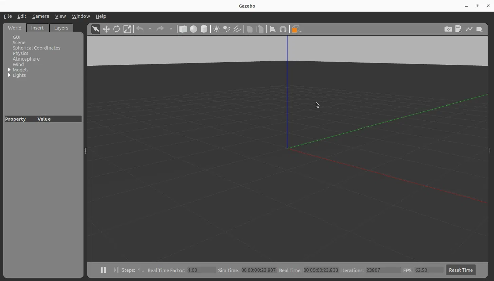
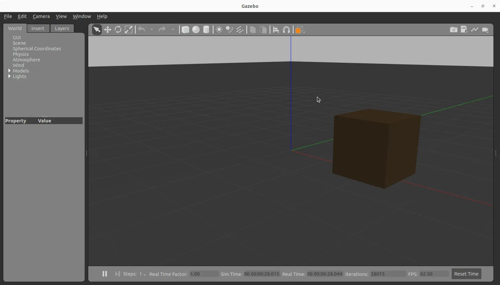
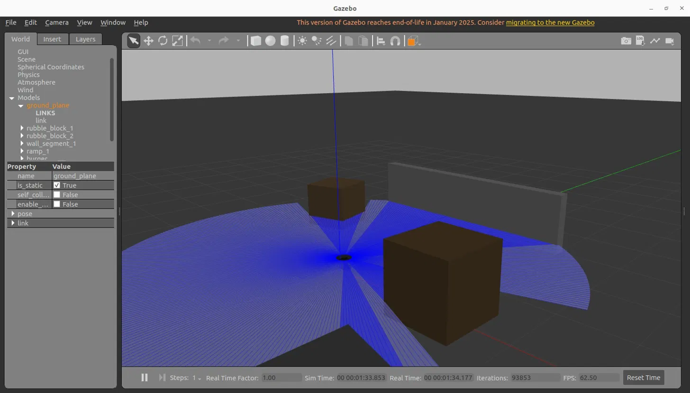
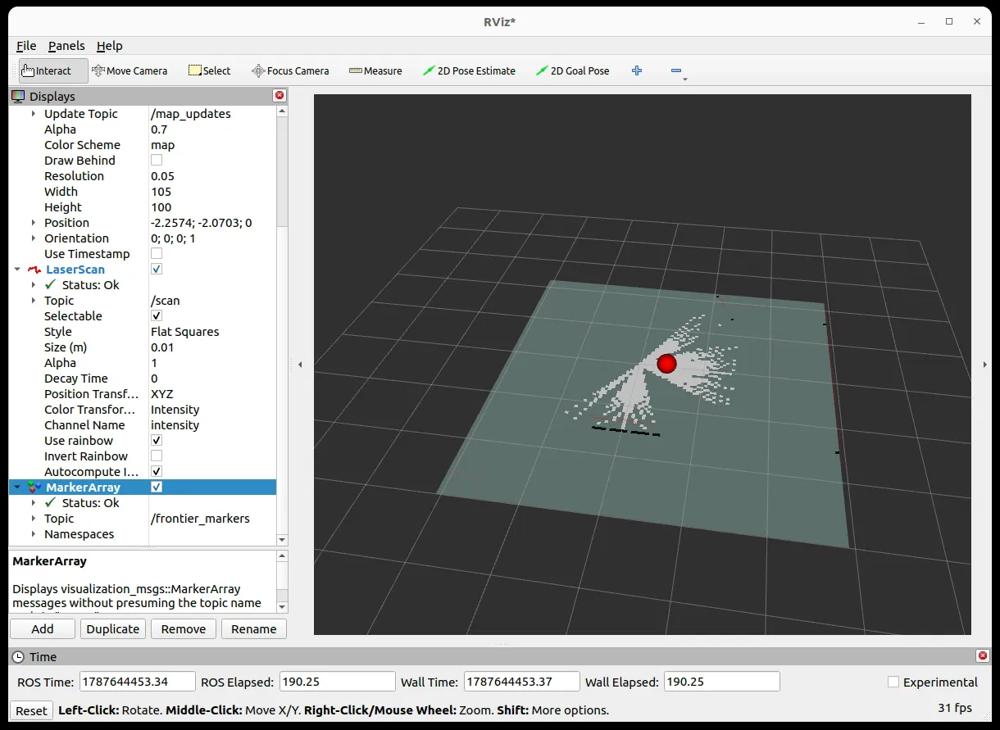
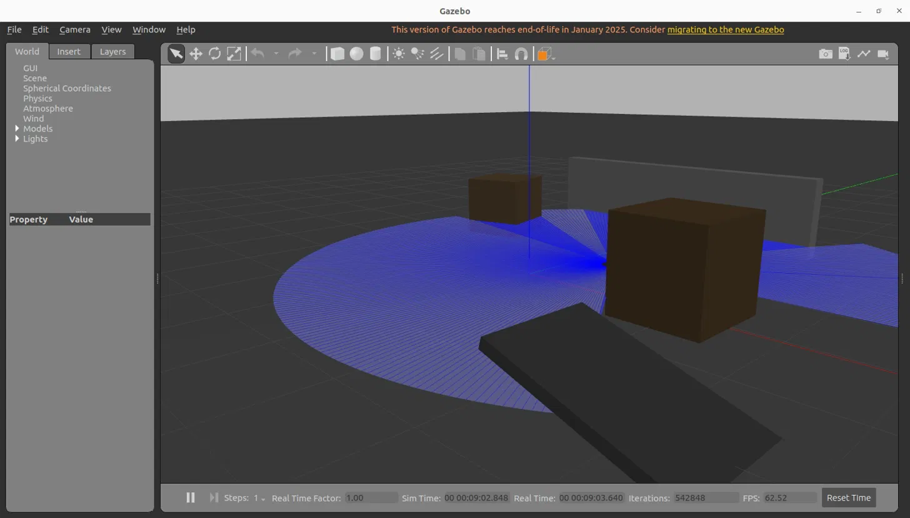
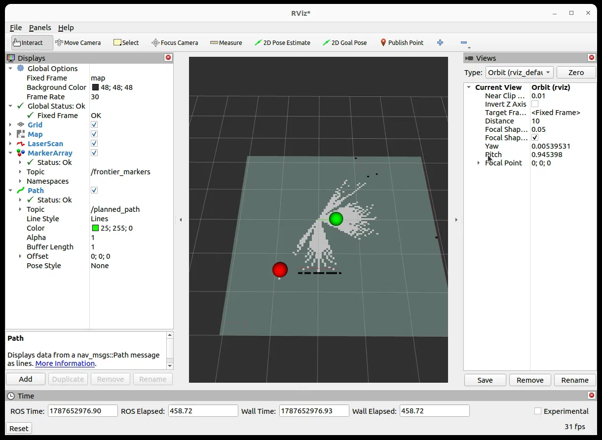
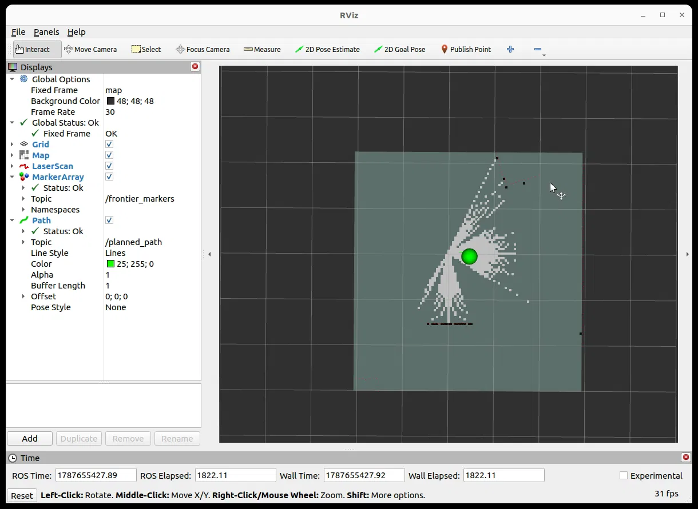

# Terrain-Aware Autonomous Frontier Exploration (ROS2 + Gazebo)

A ROS2 Humble + Gazebo simulation of a mobile robot that autonomously explores an unknown, custom-built environment, using SLAM to build a live map and a custom-written terrain-cost-weighted frontier exploration algorithm to decide where to go next, then drives there on its own.

**Author:** Prachi Kumari — [GitHub: Sanguine21](https://github.com/Sanguine21)

## Why I built this

My first project (terrain-weighted A*/Theta* path planning) proved a planning algorithm works on a static, known grid. I wanted to go a step further and build something closer to a real robotics pipeline: a robot that doesn't know its environment in advance, has to sense and map it live, decide where to explore next, and physically get there on its own, with terrain difficulty factored into that decision, not just distance or unexplored area. This project is that full pipeline, built and debugged from scratch on ROS2 and Gazebo.

## What it does, end to end

1. Simulates a small mobile robot (TurtleBot3) in a **custom-designed 3D environment** built from scratch, hand-placed obstacles (rubble-like blocks, a wall segment, a tilted ramp) rather than a pre-built demo world.
2. Uses **SLAM** (`slam_toolbox`) to build a live occupancy map from the robot's LIDAR sensor as it moves, distinguishing known-free space, known-obstacle space, and unknown space.
3. Detects **frontiers**: the boundary cells between known-free and unknown space, i.e. the candidate locations worth exploring next.
4. **Ranks frontiers** using a custom scoring formula that weighs how much new area a frontier would reveal against how costly the terrain is to reach it:
   `score = information_gain - (cost_weight * terrain_cost * information_gain)`
5. Computes an **A\* path** from the robot's current position to the best-ranked frontier, using only confirmed free space.
6. **Drives the robot autonomously** along that path, continuously replanning as the map grows, with no manual control involved.

## Project structure and phases

Built incrementally, phase by phase, each one adding a working, independently verified capability.

### Phase 1 — Environment setup
Installed and verified ROS2 Humble and Gazebo 11 on Ubuntu 22.04, including linking Gazebo's ROS plugin environment (`GAZEBO_PLUGIN_PATH` and related variables), a common setup failure point. Verified with a basic ROS2 talker/listener test and a working TurtleBot3 spawn in a pre-built demo world before writing any custom code.



### Phase 2 — Custom world, robot, and frontier detection
- Hand-built a Gazebo world file (`worlds/my_disaster_world.world`) from a blank scene up: ground plane and lighting first, then individually placed obstacles with specific positions, sizes, rotations, and colors (two rubble-style blocks, a wall segment, a tilted ramp).
- Wrote a custom ROS2 launch file (`launch/my_world.launch.py`) that spawns the TurtleBot3 robot into this custom world, adapted from the package's built-in launch file.
- Connected `slam_toolbox` to build a live map from the robot's LIDAR, visualized in `rviz2`.
- Wrote `scripts/frontier_detector.py`: a ROS2 node that reads the live occupancy grid, finds frontier cells (free cells adjacent to unknown cells), clusters nearby frontier cells into distinct exploration targets, and publishes them as visual markers in `rviz2`.

| Empty world (first test) | First obstacle added | All obstacles placed |
|---|---|---|
|  |  |  |





### Phase 3 — Terrain-cost weighting and baseline comparison
- Extended the frontier detector with a terrain-cost model: manually defined cost zones matching the obstacle layout in the custom world, and a scoring formula that discounts frontiers near high-cost terrain.
- Created `scripts/frontier_detector_baseline.py` (a copy with cost weighting disabled, `COST_WEIGHT = 0.0`) as a comparison point equivalent to classic nearest/largest-frontier exploration.
- Ran both versions over separate manual exploration sessions and logged their output to file for comparison.

**Result:** in the baseline, frontier ranking exactly followed frontier size, `score == information_gain` in every case (e.g. `info_gain=271 -> score=271.00`). In the terrain-weighted version, ranking factored in real terrain cost, one frontier's score dropped from a raw information gain of 917 to a weighted score of 486.56 due to nearby costly terrain, confirming the weighting genuinely changes which frontier is prioritized rather than only cosmetic logging.

*Caveat: the two runs explored different areas since they were driven manually rather than as identical controlled trials, so this shows overall ranking behavior differences rather than a matched frontier-by-frontier comparison.*



### Phase 4 — Path planning to the best frontier
Wrote `scripts/path_to_frontier.py`, adding an A* path planner on top of the frontier detector: given the robot's live position (from `/odom`) and the best-ranked frontier's grid location, it computes a path through confirmed free space only (treating unknown and occupied cells as obstacles), and publishes it as a `nav_msgs/Path` message, visualized as a line in `rviz2` connecting the robot to its target frontier.



### Phase 5 — Full autonomous exploration
Wrote `scripts/autonomous_explorer.py`, combining everything into one closed loop with no manual driving: sense, map, detect frontiers, rank by terrain cost, plan a path, drive along it automatically, repeat as new frontiers appear. The robot steers toward each waypoint using a simple proportional heading controller, advancing through the path as it reaches each point within a tolerance radius.

**Debugging note:** the first version of this reported "reached frontier goal" almost instantly without real movement. Diagnosed by cross-checking the robot's live `/odom` position against the target frontier coordinates, which revealed the waypoint tolerance (0.3m) was too loose relative to the fine spacing of raw A* grid waypoints. Fixed by downsampling the path to coarser waypoint spacing and tightening the tolerance to 0.15m, then verified the fix with explicit distance logging showing genuine, continuously decreasing distance-to-target values (e.g. `0.23m -> 0.22m -> 0.21m -> ... -> 0.15m`) as the robot physically moved.



## How to run it

Requires ROS2 Humble, Gazebo 11, and TurtleBot3 packages installed on Ubuntu 22.04.

```bash
export TURTLEBOT3_MODEL=burger

# Terminal 1 - world + robot
ros2 launch ~/disaster_robot_project/launch/my_world.launch.py

# Terminal 2 - SLAM mapping
ros2 launch slam_toolbox online_async_launch.py

# Terminal 3 - full autonomous exploration
python3 ~/disaster_robot_project/scripts/autonomous_explorer.py

# Terminal 4 - visualization
rviz2
# Add displays: Map (/map), LaserScan (/scan), MarkerArray (/frontier_markers), Path (/planned_path)
```

To run only frontier detection and ranking without autonomous driving, use `scripts/frontier_detector.py` instead of `autonomous_explorer.py`. To compare against unweighted exploration, use `scripts/frontier_detector_baseline.py`.

## File structure

```
disaster_robot_project/
├── worlds/
│   └── my_disaster_world.world       # Custom-built Gazebo environment
├── launch/
│   └── my_world.launch.py            # Spawns robot into the custom world
├── scripts/
│   ├── frontier_detector.py          # Detect + rank frontiers by terrain cost
│   ├── frontier_detector_baseline.py # Comparison baseline (no terrain weighting)
│   ├── path_to_frontier.py           # A* path planning to best frontier
│   └── autonomous_explorer.py        # Full autonomous closed loop
├── screenshots/                      # Evidence images referenced in this README
└── README.md
```

## Limitations and what I'd extend next

- Terrain-cost zones are manually defined to match the custom world's known obstacle layout, rather than inferred from sensor data (e.g. classifying terrain roughness from the LIDAR scan itself).
- The robot plans to one best frontier at a time rather than a multi-step exploration sequence across the whole map.
- Baseline vs. weighted comparison used separate manual driving sessions rather than identical, repeatable trials, a fixed exploration script driving both versions through the same sequence would make for a cleaner comparison.
- The proportional heading controller is simple and works for this environment's scale, but doesn't account for the robot's full kinematic constraints, which a more complete controller would handle.

## Relation to Project 1

This project extends the terrain-weighted path planning logic from my first project (a static-grid A*/Theta* comparison) into a live, sensor-driven robotics pipeline: real SLAM-based mapping, frontier-based exploration under uncertainty, and full autonomous execution, rather than planning a single path on a fully known map.

